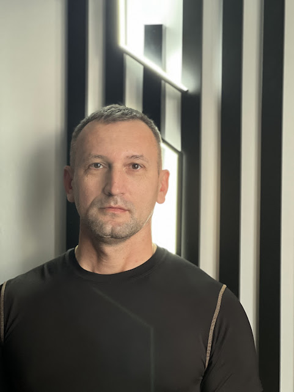

  

# Инженер по тестированию  
  

  

## Светленко Ярослав Александрович  

  

### <i>Разбираюсь в</i>  
HTML, Java, Kotlin, Python, SQL 

### <i>Использую в работе 🛠</i>  
DevTools, Postman, JMeter, IntelliJ IDEA, Git, JUnit, Selenium, Selenide, Android Studio и Espresso, Puppeteer, Playwright, Cypress, Jenkins, Teamcity и Gitlab CI  

### <i>Мои работы/публичные репозитории</i>  
[GitHub Репозитории](https://github.com/Yaroslav-neto?tab=repositories)  

# Пример одного из проектов UI & API Automation Testing (Android)

Проект по автоматизации тестирования мобильного приложения на платформе Android с использованием Mock-заглушек и автоматической генерации отчетов Allure.

## 🛠 Технический стек
- **Инструменты:** Android Studio (Ladybug/Narwhal), Gradle.
- **Окружение:** Pixel 4 (API 29), Android 10.0.
- **Репорты:** Allure 2.0.
- **Скриптинг:** PowerShell (ADB Automation) https://github.com/Yaroslav-neto/DIPLOM/blob/main/get_allure_report.ps1 и https://github.com/Yaroslav-neto/DIPLOM/blob/main/run_tests_and_report.ps1.

## 🚀 Запуск тестов

### 1. Подготовка стенда
- Запустить эмулятор Pixel 4.
- В Android Studio настроить **Network Rule** (Network Inspector) для хоста `students.netoservices.ru`:
  - **Path:** `/qamid-diplom-backend/news`
  - **Mock Body:** `{"pages": 1, "elements": []}` — это исключает влияние динамического контента на тесты.

### 2. Запуск тестов и генерация отчетов
Проект поддерживает три режима работы:

| Режим | Команда | Описание |
| :--- | :--- | :--- |
| **Автоматический** | `.\run_tests_and_report.ps1` | Полный цикл: очистка, запуск, сбор логов через ADB, генерация Allure. |
| **Полуавтомат** | `./gradlew connectedCheck` | Запуск тестов, затем сбор отчета скриптом `.\get_allure_report.ps1`. |
| **Ручной** | `./gradlew clean connectedCheck` | Ручное копирование результатов из `/data/data/...` через Device Explorer. |
| После выполнения ручного копирования отчет доступен командой:| `allure serve allure-results`|
## 📊 Результаты тестирования

### <i>Связь со мной:</i>  
- **Телефон:** +7 906 909 16 37  
- **Email:** [utes12.7@bk.ru](mailto:utes12.7@bk.ru)  
- **Телеграм:** @quatro30  

  
     

  

